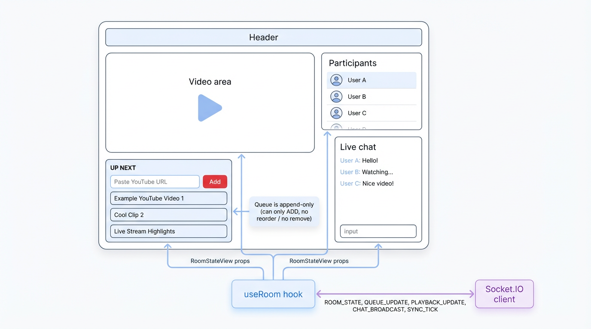

# TubeSync Frontend (`client`)

TubeSync의 **React + TypeScript + Vite** 기반 프론트엔드입니다.  
단일 룸에서 유튜브 영상을 함께 보면서, 채팅/큐/스킵 투표 등을 실시간으로 제어합니다.

## 구조 개요

- `src/main.tsx`
  - React 엔트리 포인트
  - `App` 컴포넌트를 `#root` 에 마운트
- `src/App.tsx`
  - 상단 헤더, 좌측 영상/큐, 우측 참가자/채팅 영역으로 전체 레이아웃 구성
  - `useRoom` 훅을 통해 서버 상태를 구독하고, 하위 컴포넌트에 props 로 전달
- `src/api/socket.ts`
  - Socket.IO 클라이언트 인스턴스 생성
  - 서버 주소/옵션 설정
- `src/lib/youtube.ts`
  - YouTube Iframe API 로 플레이어 로딩
  - 공통 `createYouTubePlayer` 헬퍼 제공
- `src/features/room`
  - `useRoom.ts`: 룸 상태(WebSocket 이벤트, RoomStateView)를 관리하는 커스텀 훅
  - `types.ts`: 클라이언트에서 사용되는 룸/큐/채팅/재생 타입 정의
  - `components/VideoStage.tsx`: 유튜브 플레이어 + 현재 재생 정보/스킵 투표 UI
  - `components/QueuePanel.tsx`: 유튜브 URL 큐 추가/목록 표시
  - `components/ChatPanel.tsx`: 실시간 채팅 UI
  - `components/PresencePanel.tsx`: 참가자 목록 표시
  - `components/NicknameModal.tsx`: 최초 입장 시 닉네임 입력 모달

### 화면 구성 다이어그램



## 주요 동작 흐름

1. **연결 & 입장**
   - `useRoom` 훅이 Socket.IO 연결 상태를 감시
   - 연결 후 닉네임을 입력하면 `JOIN` 이벤트 전송
2. **룸 상태 수신**
   - 서버로부터 `ROOM_STATE` 를 수신해 `RoomStateView` 를 저장
   - 이후에는 `MEMBERS_UPDATE`, `CHAT_BROADCAST`, `QUEUE_UPDATE`,
     `PLAYBACK_UPDATE`, `SKIP_VOTE_UPDATE` 이벤트로 부분 상태를 갱신
3. **영상 재생 & 동기화**
   - `VideoStage` 가 현재 재생 상태(`playback`)와 서버 시각(`lastPlaybackServerNowMs`)을 이용해
     YouTube 플레이어를 제어
   - 서버에서 주기적으로 오는 `SYNC_TICK` 이벤트로 재생 위치 드리프트 보정
4. **큐/채팅/스킵 투표**
   - 큐 추가: `QUEUE_ADD`
   - 채팅 전송: `CHAT_SEND`
   - 재생/일시정지: `PLAY_PAUSE_TOGGLE`
   - 시킹: `PLAY_SEEK`
   - 스킵 투표: `VOTE_SKIP`

## 개발/실행

```bash
cd client

# 의존성 설치
pnpm install

# 개발 서버
pnpm dev

# 빌드
pnpm build

# 린트
pnpm lint
```

개발 서버는 기본적으로 `http://localhost:5173` 에서 실행됩니다.

---

## 참고

- 전체 프로젝트 개요 및 서버 구조는 루트 [`README.md`](../README.md) 와 [`server/README.md`](../server/README.md)를 참고하세요.
